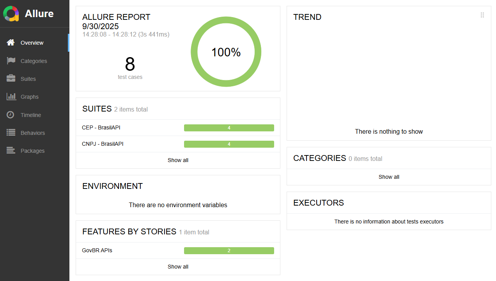

🔎 **Allure Report (última execução da main):**  
https://diegoindio.github.io/govcnpj-insights/

# GovCNPJ Insights

[](#-versão-em-português)
[](#-english-version)

---

## 🇧🇷 Versão em Português

🏛️ Projeto de automação de testes com **Cypress** para validar a **API pública BrasilAPI (dados Gov.br)**.  
O objetivo é criar uma base sólida de testes automatizados (API-first) utilizando **Service Objects**, **fixtures** e **schema validation** com Ajv.  

---

## :clipboard: Objetivos da Fase 1

- Criar uma estrutura limpa de testes Cypress com **padrões de mercado**.  
- Implementar **Service Objects** para chamadas de API (Clean Code).  
- Validar respostas com **schemas JSON** (Ajv).  
- Usar **fixtures** para massa de dados (CNPJs válidos e inválidos).  
- Preparar o projeto para evoluir para **front-end + e2e** em fases futuras.  

---

## 🛠️ Tecnologias

- [Cypress](https://www.cypress.io/) – Testes E2E e API  
- [Ajv](https://ajv.js.org/) – Validação de schemas JSON  
- [BrasilAPI](https://brasilapi.com.br/) – API pública (dados oficiais Gov.br)  
- [Allure Report](https://docs.qameta.io/allure/) – Relatórios ricos e interativos  
- [@cypress/grep](https://github.com/cypress-io/cypress-grep) – Execução seletiva de testes via tags  

---

## 📂 Estrutura

```
cypress-tests/
├── e2e/             # Testes
│   ├── consultaCnpj.cy.js
│   └── cep.cy.js
├── fixtures/        # Massa de dados
│   └── cnpjs.json
├── services/        # Service Objects (API)
│   ├── cnpjService.js
│   ├── cepService.js
│   └── index.js
├── utils/           # Schemas e helpers
│   ├── schemaCnpj.json
│   └── schemaCep.json
└── support/         # Helpers globais (Ajv, Allure, etc.)
```

---

## ▶️ Como rodar o projeto

### 1. Clonar o repositório

```bash
git clone https://github.com/<SEU_USUARIO>/govcnpj-insights.git
cd govcnpj-insights
```

### 2. Instalar dependências

```bash
npm install
```

### 3. Rodar Cypress em modo interativo

```bash
npx cypress open
```

### 4. Rodar Cypress em modo headless

```bash
npx cypress run
```

### 5. Executar com tags (grep)

```bash
# Apenas testes smoke
npx cypress run --env grepTags=smoke

# Apenas negativos
npx cypress run --env grepTags=negative

# Smoke + performance
npx cypress run --env grepTags=smoke,performance
```

---

## ✅ Cenários implementados

- Consulta de CNPJ válido → valida **status 200** e schema.  
- Consulta de CNPJ inválido → valida **status 404/400**.  
- Consulta de CEP válido (com e sem máscara) → valida **status 200** e schema.  
- CEP inexistente ou inválido → valida **status 404/400**.  

---

## 📊 Exemplo de Relatório Allure



---

## 🚦 Roadmap

- [x] Fase 1 – Automação de API (Cypress + Service Objects + Schema Validation).  
- [ ] Fase 2 – Criação de API intermediária (Next.js API Routes).  
- [ ] Fase 3 – Criação de interface web (Next.js + React).  
- [ ] Fase 4 – Automação de UI com Cypress (Page Objects).  
- [ ] Fase 5 – Integração CI/CD (GitHub Actions + Allure Reports).  

---

👨‍💻 Autor: **Diego Gomes** – QA Engineer  
🔗 Fonte de dados: [BrasilAPI](https://brasilapi.com.br/)  

---

## 🌎 English Version

🏛️ Automated testing project with **Cypress** to validate the **BrasilAPI public API (Gov.br data)**.  
The goal is to build a solid foundation of automated tests (API-first) using **Service Objects**, **fixtures**, and **schema validation** with Ajv.  

---

## :clipboard: Phase 1 Goals

- Build a clean Cypress test structure with **market standards**.  
- Implement **Service Objects** for API calls (Clean Code).  
- Validate responses with **JSON Schemas** (Ajv).  
- Use **fixtures** for test data (valid and invalid CNPJs).  
- Prepare the project to evolve into **front-end + e2e** in future phases.  

---

## 🛠️ Tech Stack

- [Cypress](https://www.cypress.io/) – API & E2E testing  
- [Ajv](https://ajv.js.org/) – JSON Schema validation  
- [BrasilAPI](https://brasilapi.com.br/) – Public API (Gov.br official data)  
- [Allure Report](https://docs.qameta.io/allure/) – Rich and interactive reports  
- [@cypress/grep](https://github.com/cypress-io/cypress-grep) – Selective test execution with tags  

---

## ▶️ How to run the project

```bash
git clone https://github.com/<YOUR_USER>/govcnpj-insights.git
cd govcnpj-insights
npm install
npx cypress run
```

Run with tags:
```bash
# Only smoke tests
npx cypress run --env grepTags=smoke
```

---

## ✅ Implemented Scenarios

- Valid CNPJ query → **200** status and schema validation.  
- Invalid CNPJ query → **404/400** status.  
- Valid CEP query (with and without mask) → **200** status and schema validation.  
- Invalid/nonexistent CEP query → **404/400** status.  

---

## 📊 Allure Report Example


---

## 🚦 Roadmap

- [x] Phase 1 – API automation (Cypress + Service Objects + Schema Validation).  
- [ ] Phase 2 – Build intermediate API (Next.js API Routes).  
- [ ] Phase 3 – Create web interface (Next.js + React).  
- [ ] Phase 4 – UI automation with Cypress (Page Objects).  
- [ ] Phase 5 – CI/CD integration (GitHub Actions + Allure Reports).  

---

👨‍💻 Author: **Diego Gomes** – QA Engineer  
🔗 Data source: [BrasilAPI](https://brasilapi.com.br/)  
